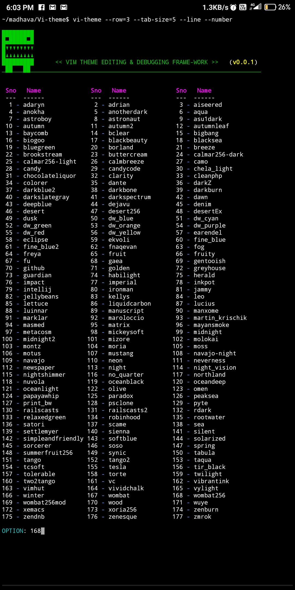
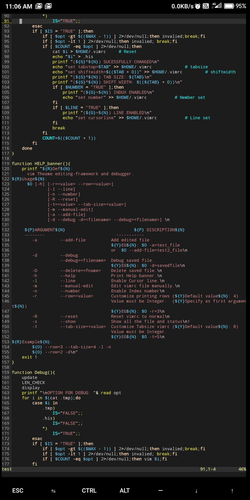
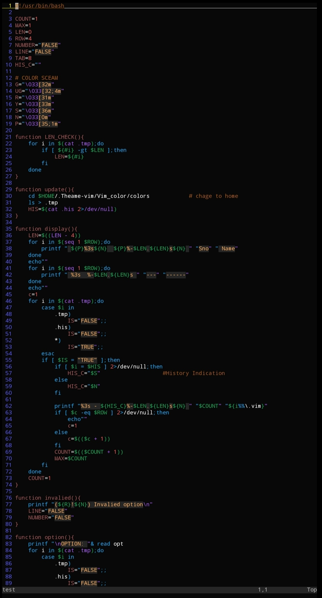
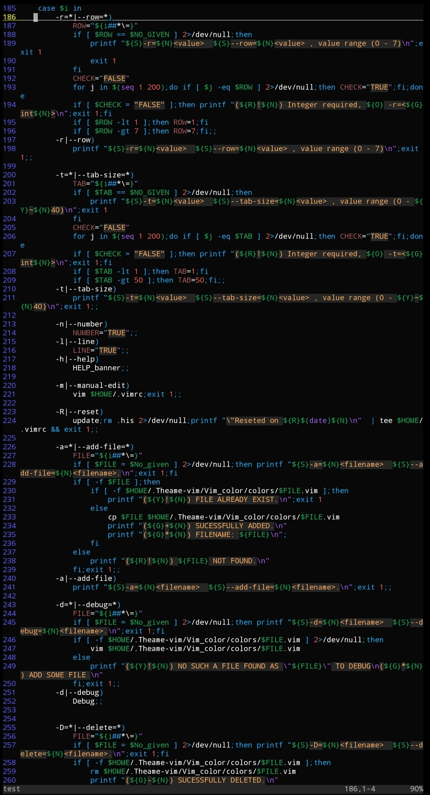
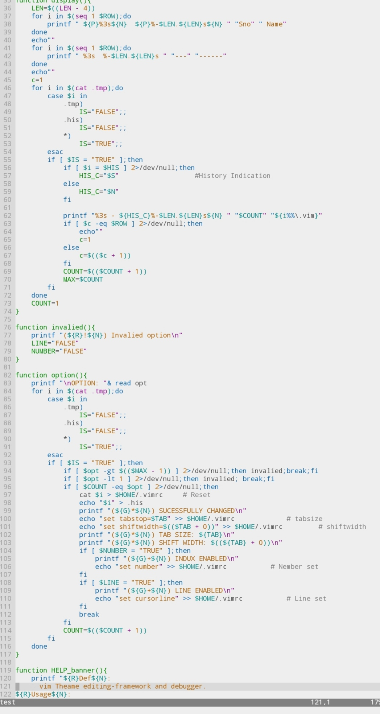
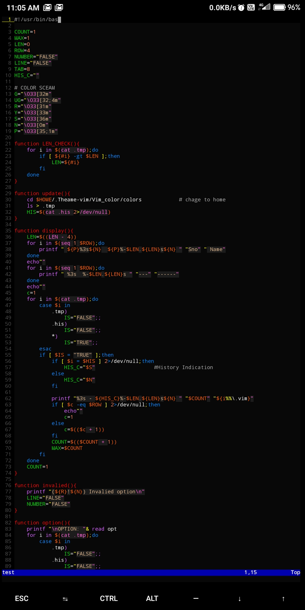

## Vi-theme
Vim Theme editing and debugging frame-work.

Easy to use. I chage my theme every time.I use it for quickly change the theme.And create own themes for further use.

## Installation:
    git clone https://github.com/Madhava-mng/Vi-theme.git && cd Vi-theme && ./setup
    
## Run:
```$ vi-theme --help```

```$ vi-theme --row=3 --tab-size=5 --line --number```

```$ vi-theme --debug```

```$ vi-theme --add=<valied filename>```

***

## Screen-shot:








